```{r, echo = FALSE}
#' Required libraries
req_libs <- c("AnnotationHub", "org.Hs.eg.db", "airway", "EnsDb.Hsapiens.v75",
              "Rsamtools", "GenomicAlignments", "reactome.db")
tmp <- lapply(req_libs, function(z) {
    if (!require(z, quietly = TRUE, character.only = TRUE))
        BiocManager::install(z)
})
```

# Introduction

## Data analysis

::: {.r-stack}
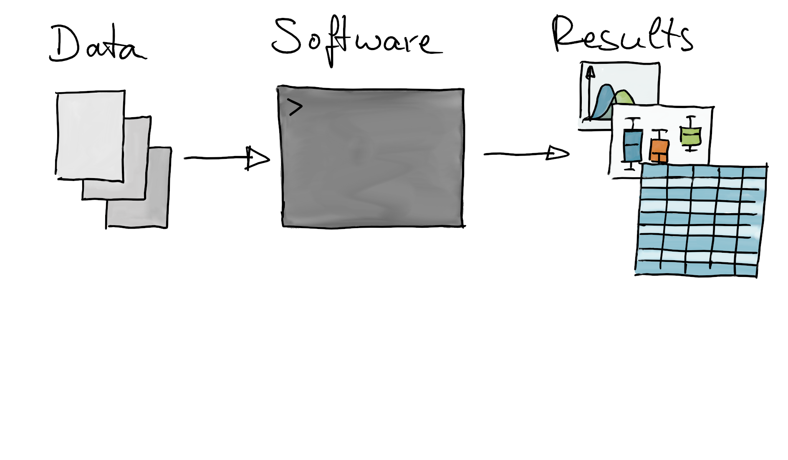{.fragment width="800"}

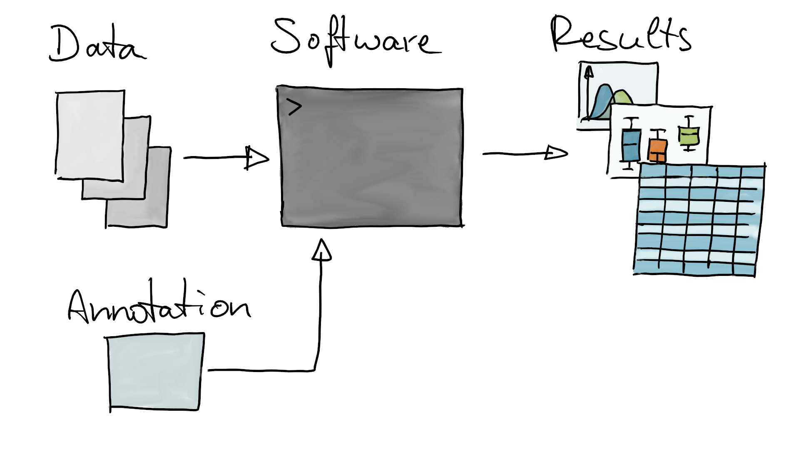{.fragment width="800"}
:::

. . .

- *Annotation*: external data fed into an analysis to make *sense* of quantified
  entities.

## Annotation

::: {.incremental}
- put a (new or different) label on an entity
- *entity*: something measured with an assay (RNA, molecule, cell)
- *label*: commonly used (standard) identifier (e.g. gene name)
- sounds trivial, but is very important task in computational biology
- examples:
  - map positions on the genome to transcripts
  - map genes to biological pathways
  - annotate cell types based on presence of marker genes
- :dart: enable or assist in interpretation; make biological sense of assay
  data.
:::

## In this presentation

. . .

- :one: provide some general information on annotation
- :two: give you an overview on available annotation resources
- :three: short use cases (with code)

# {.center}

::: {.r-fit-text}
:one: General information on annotation
:::

## What do we need for annotation?

::: {.incremental}
- :one: an **annotation resource**: reference information on entities or a
  mapping of one type of identifiers to another.
- :two: a **rule** that defines how to assign labels to entities
  - annotation through similarity: sequence similarity, spectral similarity
  - direct mapping 
:::

## What do we need for annotation? {transition="none"}

- :one: an **annotation resource**: reference information on entities or a
  mapping of one type of identifiers to another.
- :two: a **rule** that defines how to assign labels to entities
- *examples*
  - map between gene identifiers (Ensembl, NCBI, ...)
  
  IMAGE
  
## What do we need for annotation? {transition="none"}

- :one: an **annotation resource**: reference information on entities or a
  mapping of one type of identifiers to another.
- :two: a **rule** that defines how to assign labels to entities
- *examples*
  - annotate through sequence similarity: map short reads to genome
  
  IMAGE

## What do we need for annotation? {transition="none"}

- :one: an **annotation resource**: reference information on entities or a
  mapping of one type of identifiers to another.
- :two: a **rule** that defines how to assign labels to entities
- *examples*
  - cell types through presence of marker genes

IMAGE

. . .

- :warning: there might be uncertainty in annotation

## Reproducibility

In order to guarantee **reproducibility** of annotation:

:white_check_mark: annotation resource has to be **versioned** and **findable**

. . .

:no_good: dynamic annotation resources (daily updates) without the possibility
to access a specific version

. . .

:white_check_mark: the **same version** should be used throughout the **whole**
analysis

. . .

:no_good: using a different genome release for RNA-seq alignment and gene
counting.

## Standardization and metadata

- **Common nomenclature is required**
- It's great if you can assign a name to an entity - but also other researchers
  should understand what you mean.

. . .

- *example*: synonyms
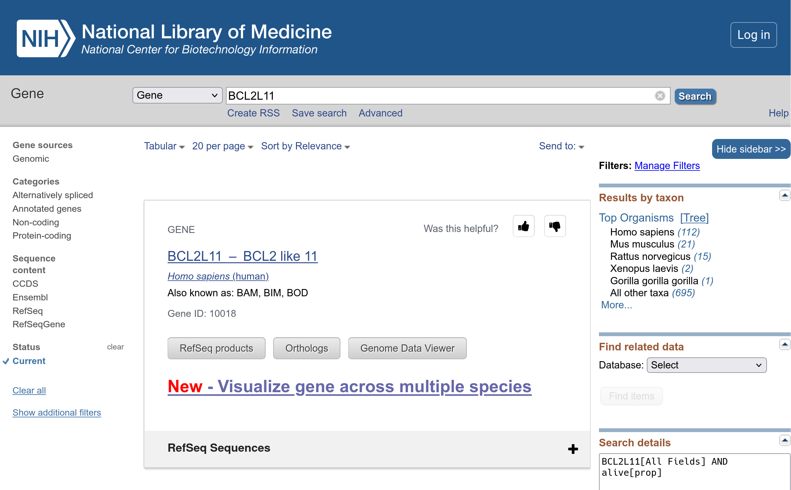

. . .

- Synonyms: aliases or previous names of entities.

. . .

- Can be tricky if different names are used across publications.
- :point_right: use the official HGNC gene name! 

## Standardization and metadata

- :scream_cat: ... it can always be worse ...

. . .

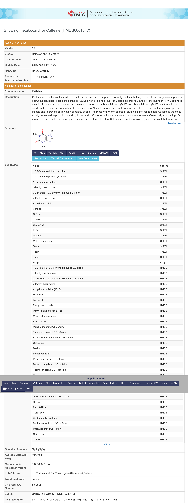

*Why?* annotation resource was compiled from community provided information.

. . .

- **Standardization and common nomenclature is important!**
- Standardization is important for human consumers, but even more so for
  computational use (including AI).

# {.center}

::: {.r-fit-text}
:two: Annotation resources
:::

## Annotation resources

- Where can you get annotations from?

## Annotation resources

**For genes**

- [NCBI](https://www.ncbi.nlm.nih.gov/), [Ensembl](https://ensembl.org), ...

. . .

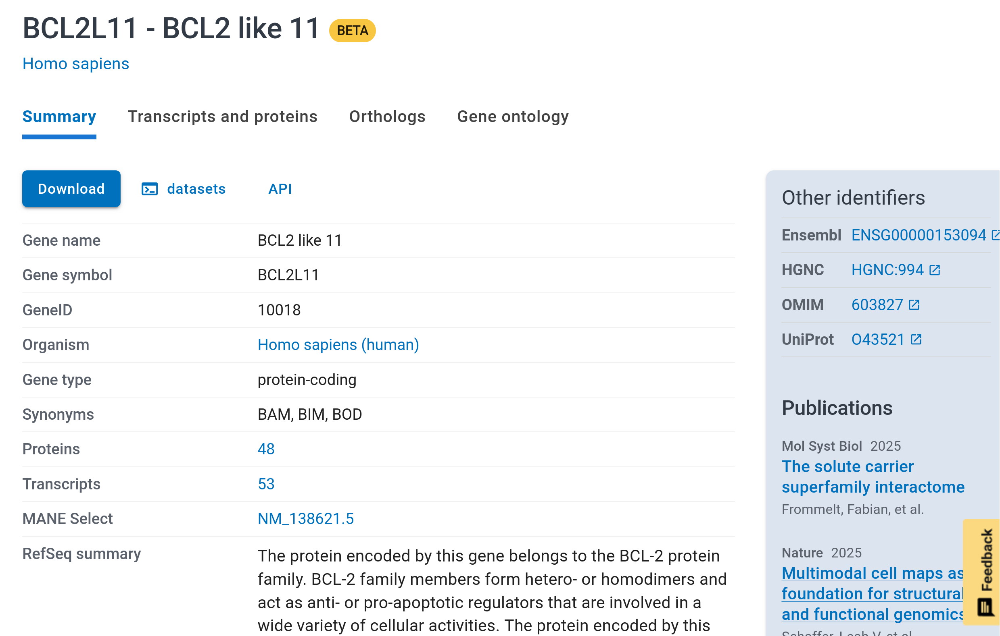{.absolute width="800"}

. . .

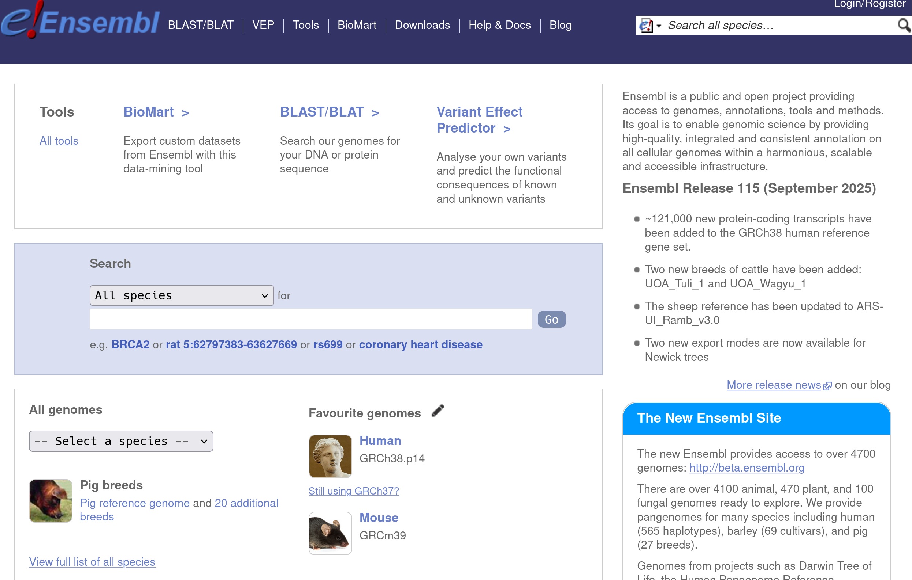{width="800"}


## Annotation resources

**For proteins**

- [UniProt](https://www.uniprot.org/), [Ensembl](https://ensembl.org),
  ...

. . .

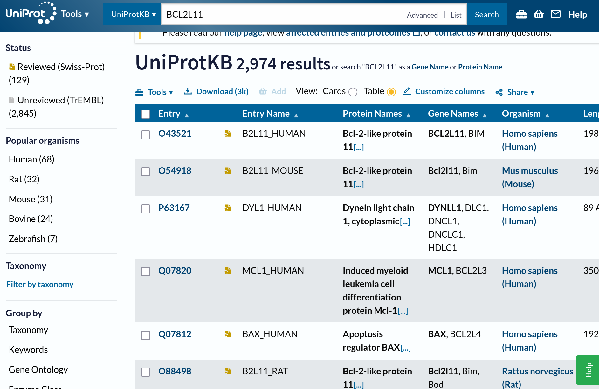{width="800"}


## Annotation resources

**For small molecules**

- [HMDB](https://hmdb.ca), [MassBank](https://massbank.eu), ...

. . .

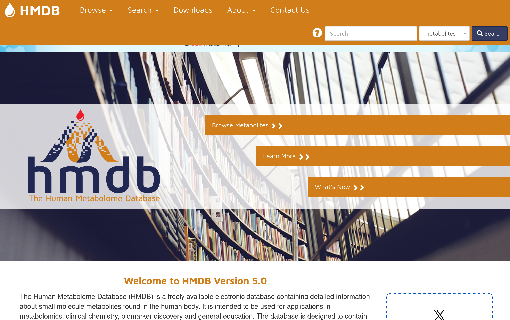{.absolute width="800"}

. . .

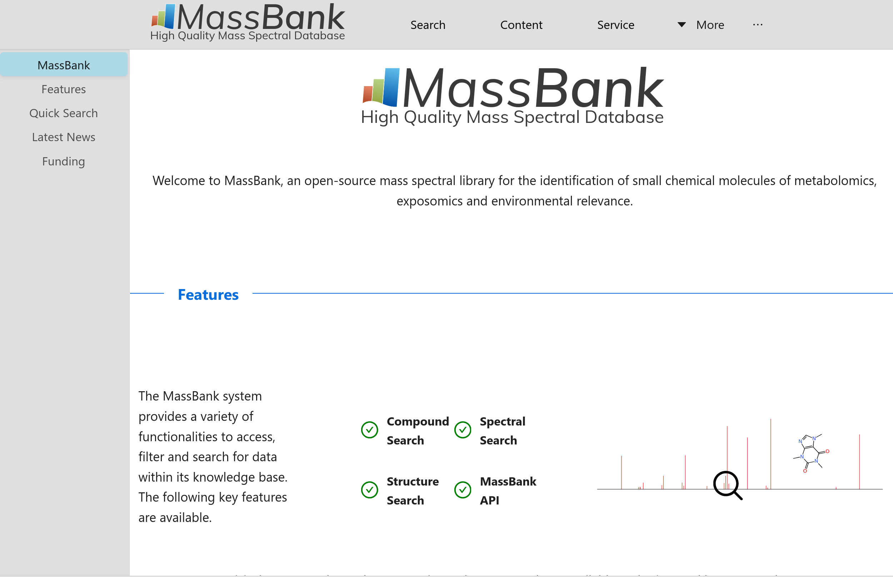{width="800"}


## Annotation resources

**Pathways**

- [reactome](https://reactome.org/),
  [wikipathways](https://www.wikipathways.org/), [KEGG](https://www.kegg.jp/)

. . .

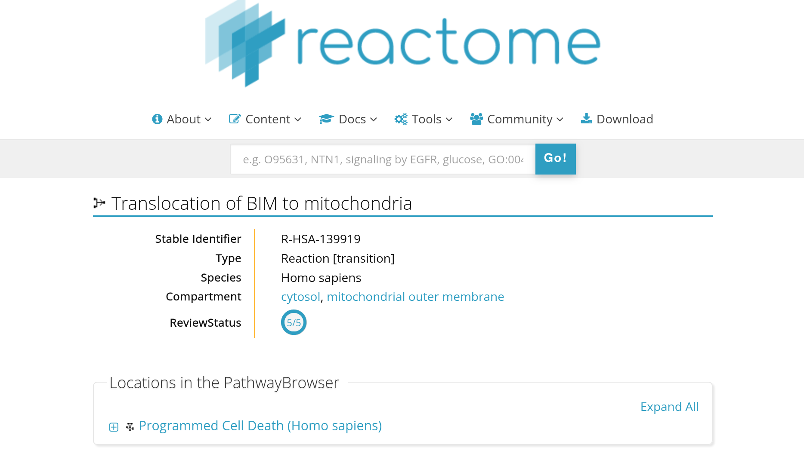{width="800"}


## Annotation resources

**Pathways**

- [reactome](https://reactome.org/),
  [wikipathways](https://www.wikipathways.org/), [KEGG](https://www.kegg.jp/)

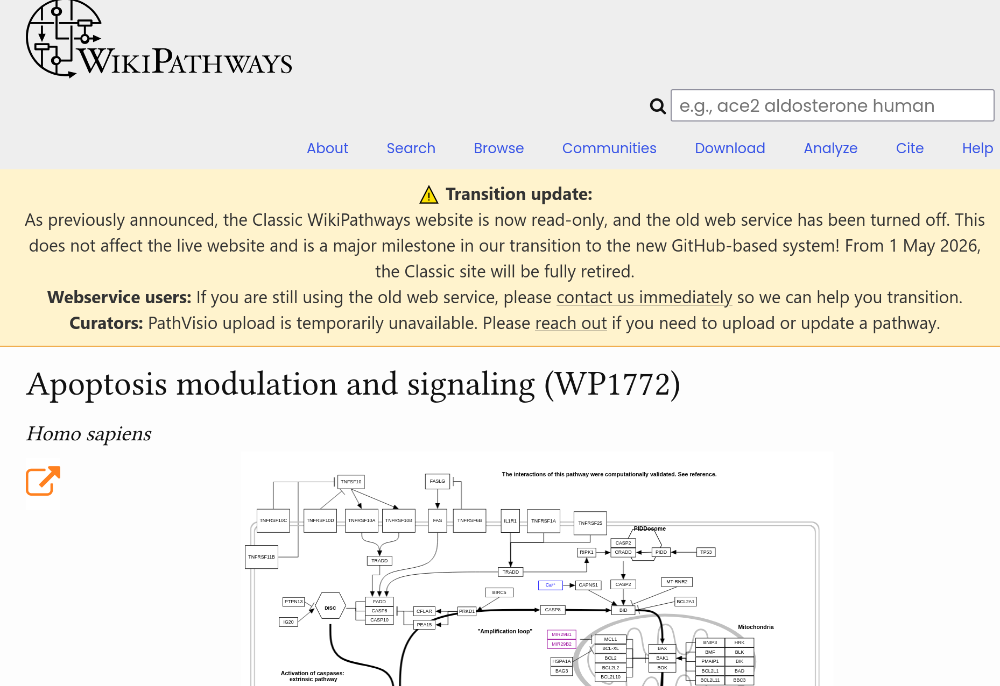{width="800"}


## Annotation resources

**Pathways**

- [reactome](https://reactome.org/),
  [wikipathways](https://www.wikipathways.org/), [KEGG](https://www.kegg.jp/)

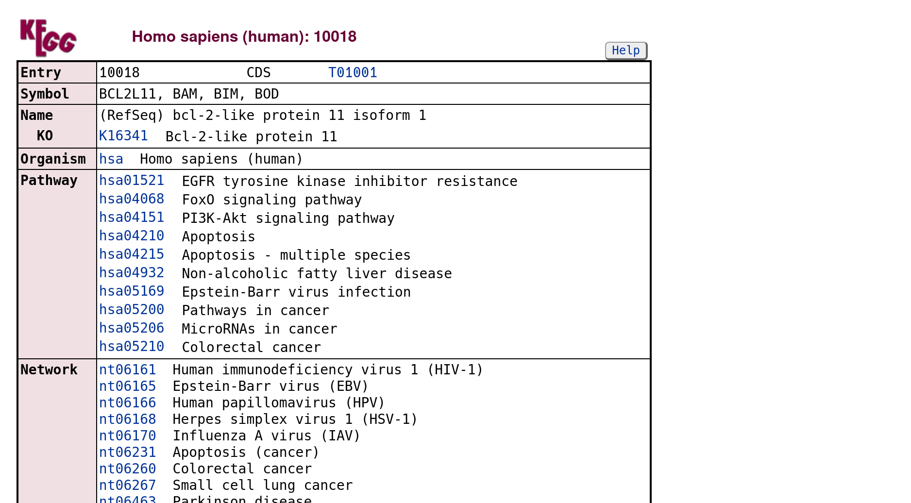{width="800"}

. . .

- :unamused: some annotation resources use their own data/file format making it
  cumbersome to include them in data analysis workflows.


## Bioconductor annotation resources

. . .

- Format standardized to simplify integration into the analysis (big thanks to
  the maintainers! :raised_hands:)
- *AnnotationDbi* package defines a common interface to extract information from
  annotation resources: `mapIds()` and `select()` functions.

## Bioconductor annotation resources

. . .

{.absolute top=70 right=80 height="80"}
- :ring: one to get them all: *AnnotationHub*

. . .

- Centrally managed annotation resources.

```{r}
#| code-line-numbers: "1|3-4|5-6"
#| echo: TRUE
#| output-location: fragment
library(AnnotationHub)

#' Synchronize and cache AnnotationHub information locally
ah <- AnnotationHub()
#' List all available resources
ah
```

. . .

- Resources come in variety of different formats and data types.

. . .

```{r}
#| echo: TRUE
#| output-location: fragment
#' List data class
table(ah$rdataclass)
```

. . .

- Resource can be a reference to an external file

```{r}
#| echo: TRUE
query(ah, c("ensembl", "TwoBitFile"))
```

. . .

```{r}
#| echo: TRUE
ah["AH49592"]
```

. . .

- Or a dedicated R object.
- We retrieve one such object from *AnnotationHub*.

```{r}
#| echo: TRUE
query(ah, c("Hsapiens", "EnsDb"))
```

```{r}
#| echo: TRUE
edb <- ah[["AH119325"]]
edb
```

- :information_source: data is downloaded and cached. Subsequent calls will load
  the data from the cache.

## Bioconductor annotation resources

- ... and there are also dedicated R packages with specific annotations.
- *example*: identifiers and metadata for human genes.

```{r}
#| echo: TRUE
library(org.Hs.eg.db)
org.Hs.eg.db
```

- Most annotation resources provide mapping between gene identifiers or mapping
  to e.g. pathways.
- Also available: *position-relative annotations*.

## Position-relative annotations {transition="none"}

- Mapping between entities (genes, exons) and positions (on the genome, within a
  transcript).
- `GenomicFeatures::TxDb` resources.

## Position-relative annotations {transition="none"}

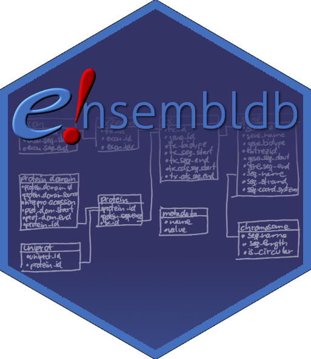{.absolute top=150 right=80 height="80"}

- Mapping between entities (genes, exons, **protein domains**) and positions (on
  the genome, within a transcript, within a **protein**).
- `GenomicFeatures::TxDb` and `ensembldb::EnsDb` resources.

## Position-relative annotations {transition="none"}

{.absolute top=150 right=80 height="80"}

- Mapping between entities (genes, exons, protein domains) and positions (on
  the genome, within a transcript, within a protein).
- `GenomicFeatures::TxDb` and `ensembldb::EnsDb` resources.
- Organism and release-specific data (SQLite databases).

- Positional information: genomic position of exons

```{r}
#| echo: TRUE
#| output-location: fragment
#' extract exon coordinates from resource downloaded form AnnotationHub
exons(edb)
```

. . .

:information_source: such resources can also used to map e.g. between positions
within a protein and the location of the encoding sequence in the genome.

# {.center}

::: {.r-fit-text}
:three: Use cases
:::

## Annotating RNA-seq, raw reads


**Drawing**

- short RNA read -> map to genome, get positional mappings.
- positions: use TxDb, EnsDb to get 


## Annotation RNA-seq, raw reads

- *example* [@love_rna-seq_2015]:
  - bulk RNA-seq data
  - alignment against genome using [STAR](https://code.google.com/p/rna-star/)

```{r}
#| echo: TRUE
library(airway)
dir(system.file("extdata", package = "airway"))
```

. . .

- *task*: quantifying reads per gene.
- *required*: positional (genome) information for genes (exons)
- :point_right: get annotation resource for genome version / Ensembl release.

. . .

```{r}
#| echo: TRUE
library(EnsDb.Hsapiens.v75)
edb <- EnsDb.Hsapiens.v75
```

. . .

- Get positional information for exons

```{r}
#| echo: TRUE
exns <- exonsBy(edb, by = "gene")
exns
```

. . .

- Get the BAM files with the alignment results for the present experiment.

```{r}
#| echo: TRUE
#' Get the BAM file names in the *airway* package
f <- dir(system.file("extdata", package = "airway"),
         pattern = "bam$", full.names = TRUE)

library("Rsamtools")
bamfiles <- BamFileList(f, yieldSize = 2000000)
```

. . .

- Use `GenomicAlignments::summarizeOverlaps()` to count reads falling within
  exon boundaries.

```{r}
#| echo: TRUE
library(GenomicAlignments)
se <- summarizeOverlaps(features = exns, reads=bamfiles,
                        mode = "Union", singleEnd = FALSE,
                        ignore.strand = TRUE,
                        fragments = TRUE)
se
```

. . .

- Result: gene count data.
- :information_source: afternoon labs will use an updated workflow using
  *Salmon* for alignment against the transcriptome and the *tximeta*
  Bioconductor package for managing data and annotation resources.

## Annotating gene information

- Common task in annotation: add additional metadata to existing identifiers.
- *example*: bulk RNA-seq data *airway*:

```{r}
#| echo: TRUE
#| warning: FALSE
se
```

:information_source: gene quantification data, 8 samples.

. . .

- What gene identifiers do we have?

```{r}
#| echo: TRUE
#| output-location: fragment
#' extract gene identifiers
ids <- rownames(se)
head(ids)
```

. . .

- We've got Ensembl gene IDs.
- :dart: get official HGNC gene symbols (names) the genes.

. . .

- :point_right: use `AnnotationDbi::mapIds()` with *org.Hs.eg.db*.

```{r}
#| echo: TRUE
library(org.Hs.eg.db)
#' available gene annotations:
columns(org.Hs.eg.db)
```

. . .

```{r}
#| echo: TRUE
#| code-line-numbers: "1-2|3"
#| output-location: fragment
#' map Ensembl gene IDs to official gene symbols
symbols <- mapIds(org.Hs.eg.db, keys = ids, keytype = "ENSEMBL",
                  column = "SYMBOL", multiVals = "first")
head(symbols)
```

. . .

:information_source: `multiVals`... to handle ambiguity; default is `"first"`
but there are other options too.

:information_source: that's one way; we could also use *ensembldb*'s `EnsDb`
resources (to ensure we use the same release versions).

. . .

```{r}
#| echo: TRUE
symbols <- mapIds(edb, keys = ids, keytype = "GENEID",
                  column = "SYMBOL", multiVals = "first")
```

## Annotation for enrichment analysis

- going one step further ... :dart: annotating genes to biological pathways.

#### Drawing:

- gene identifiers left, pathways right.
- need to map between them using the same identifier.
- map Ensembl genes to EntrezIds.

## Annotation for enrichment analysis

- Enrichment analysis for biological pathways from
  [reactome](https://reactome.org).
- *example*: use the *reactome.db* package to get the list of genes per pathway.

```{r}
#| echo: TRUE
#| output-location: fragment
#| code-line-numbers: "1|3-4"
library(reactome.db)

#' Available data
columns(reactome.db)
```

. . .

:information_source: gene identifiers: NCBI EntrezGene IDs.

- get gene and pathway IDs for all genes.

. . .

```{r}
#| echo: TRUE
#| output-location: fragment
#| code-line-numbers: "1-2|3"
mapping <- select(reactome.db, keys = keys(reactome.db),
                  columns = c("ENTREZID", "PATHID"))
head(mapping)
```

. . .

- Convert into a `list` of genes per pathway.

```{r}
#| echo: TRUE
#| output-location: fragment
#| code-line-numbers: "1|2"
gs <- split(mapping$ENTREZID, mapping$PATHID)
gs[1:2]
```

. . .

- Annotate the Ensembl gene IDs to NCBI EntrezGene IDs with `mapIds()`.

```{r}
#| echo: TRUE
#| warning: FALSE
entrez <- mapIds(edb, keys = rownames(se), keytype = "GENEID",
                 column = "ENTREZID", multiVals = "first")
```

. . .

- :point_right: use this definition of gene sets in enrichment functions,
  such as `EnrichmentBrowser::sbea()` or others.
  
. . .

```{r}
#| echo: TRUE
#| eval: FALSE
library(EnrichmentBrowser)

rownames(se) <- entrez
#' ... assuming differential expression analysis was done too ...
res <- sbea(method = "ora", se, gs = gs)
```

. . .

:information_source: *EnrichmentBrowser* makes the mapping easier with
its `idMap()` and `getGenesets()` functions.

## Annotating mass spectrometry data

- ... :eyes: Thursday's Metabolomics lecture ...

## Annotating cell types

- single cell things.
- presence of marker genes.

https://eur03.safelinks.protection.outlook.com/?url=https%3A%2F%2Fwww.bioconductor.org%2Fpackages%2Frelease%2Fbioc%2Fhtml%2FSingleR.html&data=05%7C02%7CJohannes.Rainer%40eurac.edu%7Ca5ef0a729b264253177808deaaa53ee5%7C9251326703e3401a80d4c58ed6674e3b%7C0%7C0%7C639135823868571203%7CUnknown%7CTWFpbGZsb3d8eyJFbXB0eU1hcGkiOnRydWUsIlYiOiIwLjAuMDAwMCIsIlAiOiJXaW4zMiIsIkFOIjoiTWFpbCIsIldUIjoyfQ%3D%3D%7C0%7C%7C%7C&sdata=%2FLc1d%2FNC41cWamIy46XugMZlqvhQoaW2tKbRscUFDdk%3D&reserved=0


## {.center}

::: {.r-fit-text}
**Thank you for your attention :raised_hands:**
:::

## References
