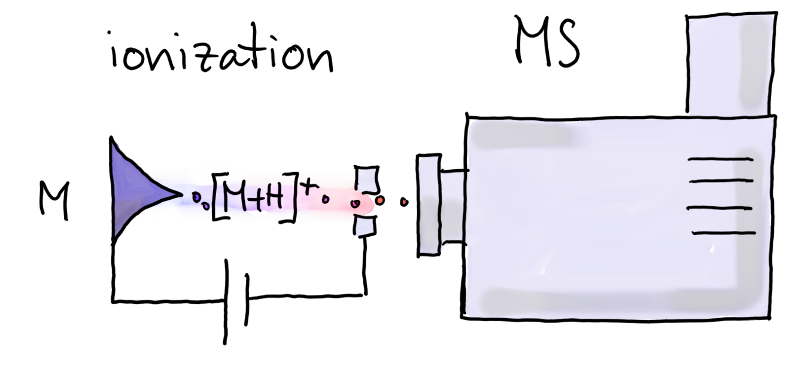
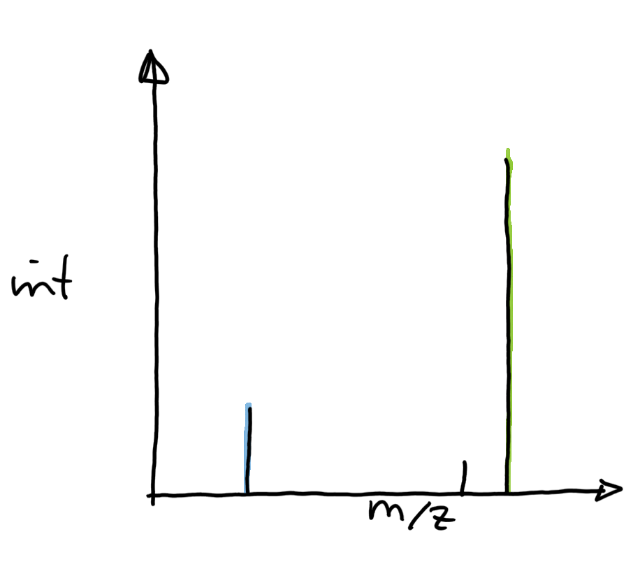

<style type="text/css">

slides > slide:not(.nobackground):after {
  content: '';
}

slides > slide {
    -webkit-transition:none !important;transition:none !important;
}

.build > * {
  -webkit-transition: opacity 0.1s ease-in-out;
  -webkit-transition-delay: 0.1s;
  -moz-transition: opacity 0.1s ease-in-out 0.1s;
  -o-transition: opacity 0.1s ease-in-out 0.1s;
  transition: opacity 0.1s ease-in-out 0.1s;
}

</style>

## Content

- Introduction to metabolomics
- Preprocessing of LC-MS data in Bioconductor

## Metabolomics? {.build}

<div>
- Large-scale study of small molecules (metabolites) in a system (cell, tissue,
  organism).
- Metabolites: intermediates and products of cellular processes.
</div>
- Metabolome?
  - **Genome**: what can happen.
  - **Transcriptome**: what appears to be happening.
  - **Proteome**: what makes it happen.
  - **Metabolome**: what actually happened.

<div>
- Metabolome influenced by genetic **and** environmental factors.
</div>

----

Image of glycolisis
https://en.wikipedia.org/wiki/Glycolysis


## How can we measure metabolites? {.dark}


- Nuclear Magnetic Resonance (NMR) - not covered here.
- Mass spectrometry (MS)-based metabolomics.


## Mass Spectrometry (MS) {.build .dark}

<div>

</div>
<div>

</div>

<div style="position:absolute; top:65%;left:7%">
- **Problem:** unable to distinguish between metabolites with the same 
  mass-to-charge ratio (m/z).
- **Solution:** separate metabolites prior to MS by another property.
</div>
  
<!-- Now comes the incremental LC-MS description -->
## | **Liquid Chromatography Mass Spectrometry (LC-MS)** {.notransition}


## | **Liquid Chromatography Mass Spectrometry (LC-MS)** {.notransition}


## | **Liquid Chromatography Mass Spectrometry (LC-MS)** {.notransition}


## | **Liquid Chromatography Mass Spectrometry (LC-MS)** {.notransition}


## | **Liquid Chromatography Mass Spectrometry (LC-MS)** {.notransition}


## | **Liquid Chromatography Mass Spectrometry (LC-MS)** {.notransition}


## | **Liquid Chromatography Mass Spectrometry (LC-MS)** {.notransition}


## | **Liquid Chromatography Mass Spectrometry (LC-MS)** {.notransition}


## LC-MS data preprocessing

> - Chromatographic peak detection
> - Alignment
> - Correspondence

## Chromatographic peak detection

- Aim: identify chromatographic peaks in the data.


## Chromatographic peak detection

- Aim: identify chromatographic peaks in the data.


## Chromatographic peak detection

- __centWave__ [Tautenhahn et al. *BMC Bioinformatics*, 2008]:
- Step 1: identify *regions of interest*.


## Chromatographic peak detection

- Step 2: peak detection using continuous wavelet transform.
- Allows detection of peaks with different widths.


## Chromatographic peak detection | with `xcms` {.build}

- After reading the data with `readMSData` (`MSnbase` package):
- `findChromPeaks` function, passing settings along with an algorithm-specific
  *parameter* object.

```{r eval = FALSE}
## Perform centWave peak detection on the MSnExp object
cwp <- CentWaveParam(peakwidth = c(2, 10), snthresh = 5)
data <- findChromPeaks(data, param = cwp)
```


## Alignment

- Chromatography subject to (random and systematic) noise.
- Same analyte may elute at different time.

## Correspondence

- Aim: group peaks across samples, assuming that they represent the same ion.

## Normalization

## Identification

- Match compounds based on features' m/z.
- Lab-internal databases with approximate retention times for specific
  compounds.

## Afternoon lab

- LC-MS data handling (`MSnbase`).
- LC-MS data preprocessing using `xcms`.
